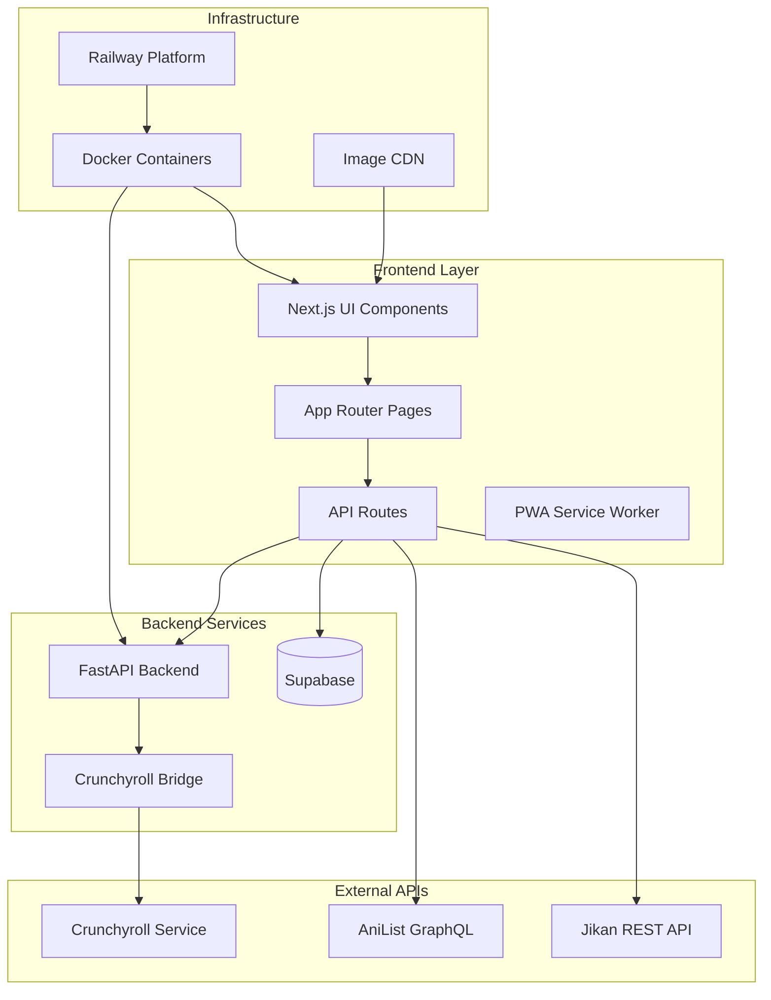
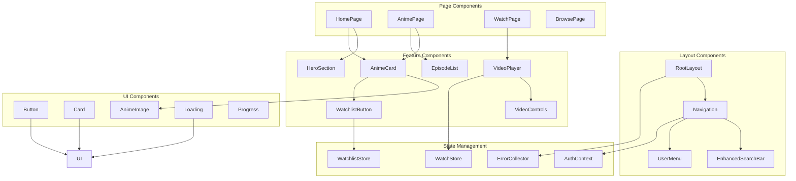
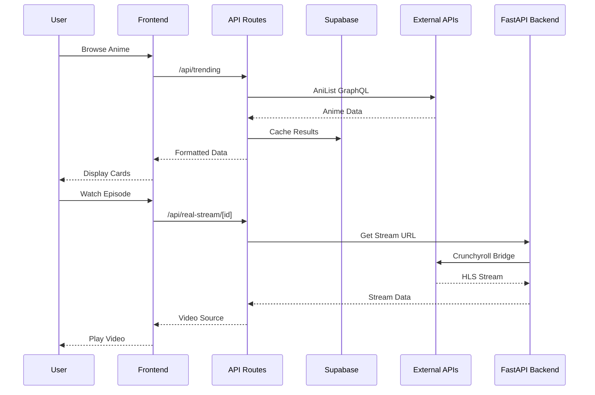
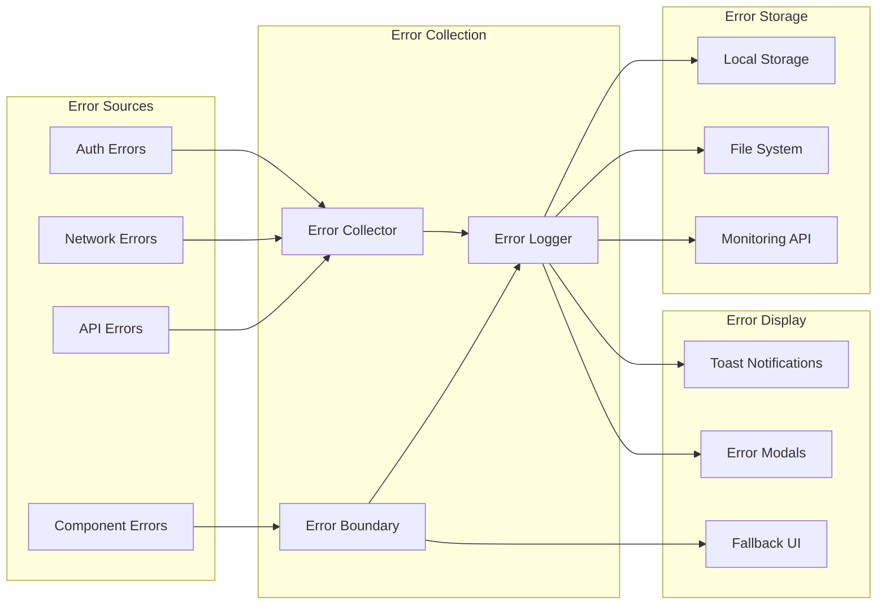
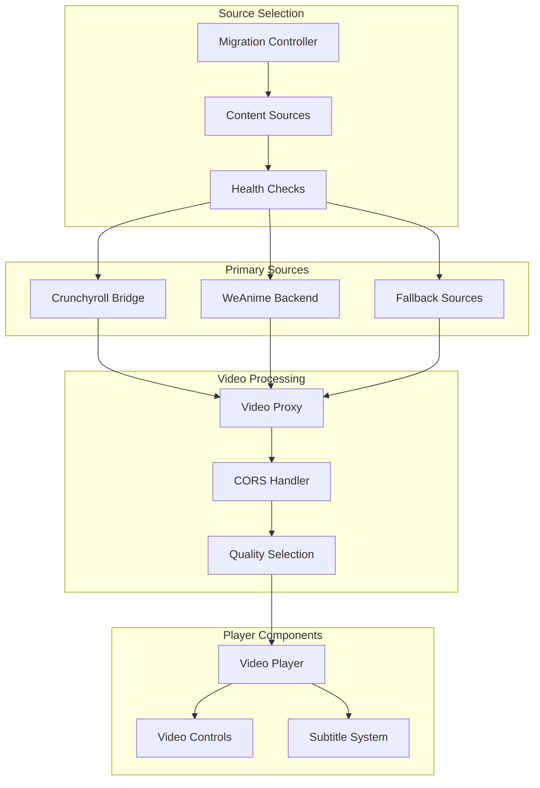
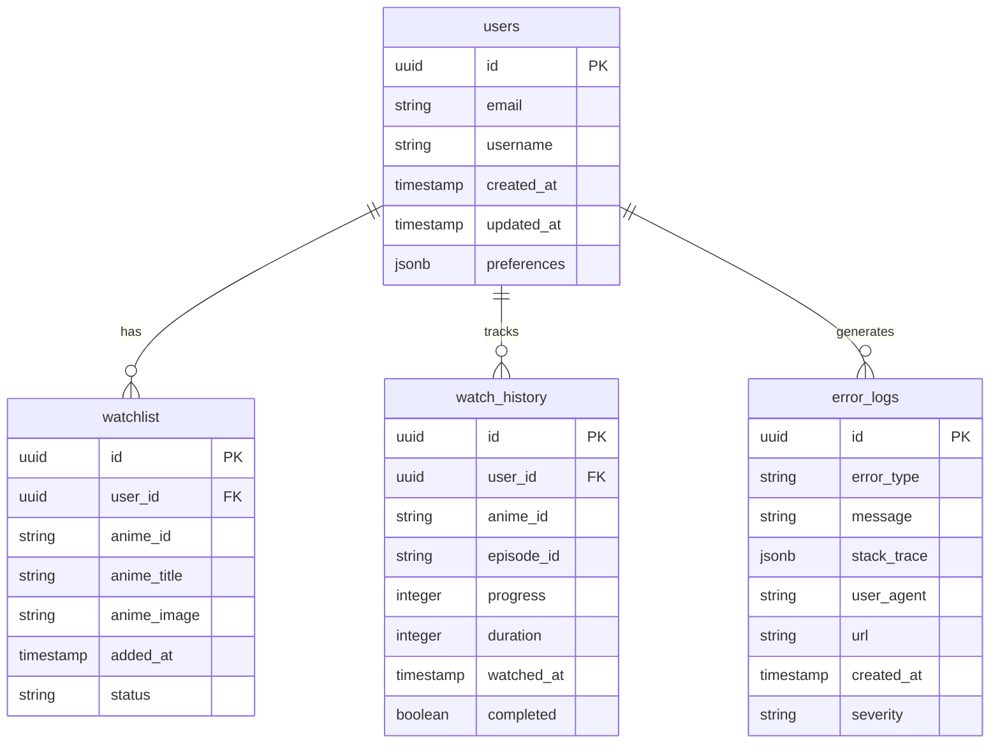
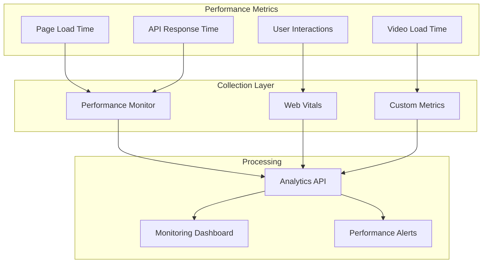
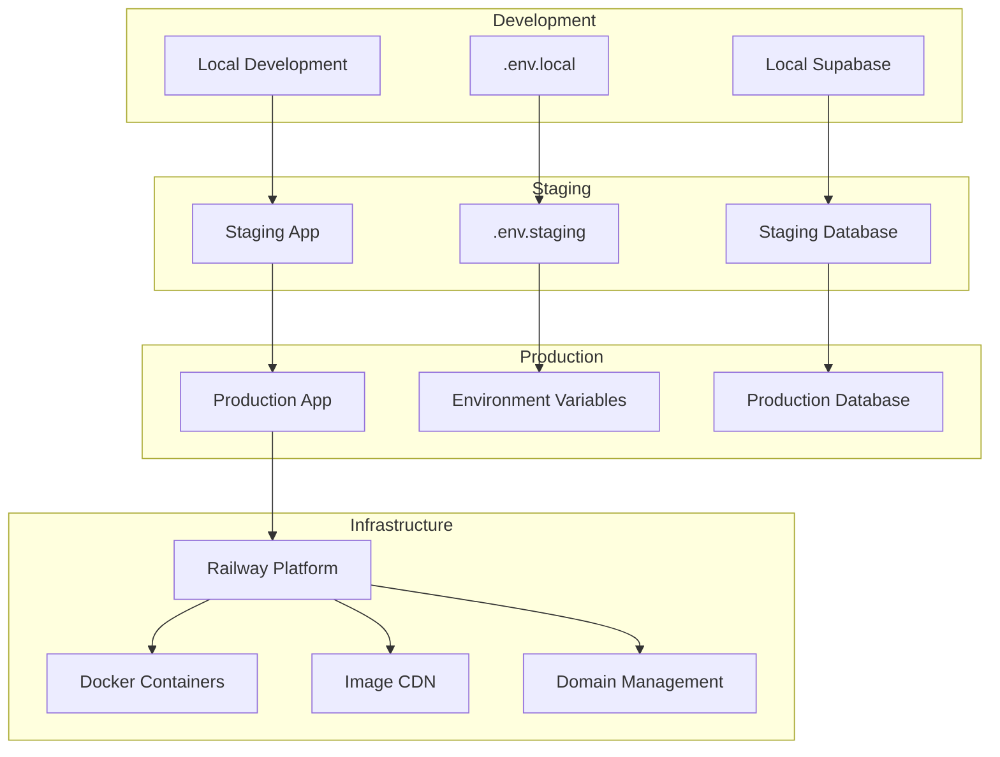

# WeAnime Architecture Diagrams

## System Architecture Overview



## Component Relationship Diagram



## Data Flow Architecture



## Authentication Flow

```mermaid
flowchart TD
    Start[User Access] --> AuthCheck{Authenticated?}
    
    AuthCheck -->|No| LoginPage[Login Page]
    AuthCheck -->|Yes| Dashboard[Dashboard]
    
    LoginPage --> LoginForm[Login Form]
    LoginForm --> AuthAPI[/api/auth/login]
    
    AuthAPI --> SupabaseAuth{Supabase Available?}
    SupabaseAuth -->|Yes| SupabaseLogin[Supabase Auth]
    SupabaseAuth -->|No| DemoAuth[Demo Authentication]
    
    SupabaseLogin --> JWT[JWT Token]
    DemoAuth --> MockJWT[Mock JWT]
    
    JWT --> SetSession[Set Session]
    MockJWT --> SetSession
    
    SetSession --> Dashboard
    Dashboard --> ProtectedRoute[Protected Routes]
    
    ProtectedRoute --> ValidateJWT{Valid JWT?}
    ValidateJWT -->|Yes| AllowAccess[Allow Access]
    ValidateJWT -->|No| RedirectLogin[Redirect to Login]
    
    RedirectLogin --> LoginPage
```

## Error Handling Architecture



## Video Streaming Architecture



## Database Schema (Supabase)



## Performance Monitoring Flow



## Deployment Architecture



## Security Architecture

```mermaid
graph TD
    subgraph "Frontend Security"
        CSP[Content Security Policy]
        CORS[CORS Configuration]
        HTTPS[HTTPS Enforcement]
        SRI[Subresource Integrity]
    end
    
    subgraph "Authentication"
        JWT[JWT Tokens]
        Supabase[Supabase Auth]
        Session[Session Management]
        Refresh[Token Refresh]
    end
    
    subgraph "API Security"
        RateLimit[Rate Limiting]
        Validation[Input Validation]
        Sanitization[Data Sanitization]
        AuthMiddleware[Auth Middleware]
    end
    
    subgraph "Data Protection"
        Encryption[Data Encryption]
        SecureStorage[Secure Storage]
        BackupSecurity[Backup Security]
        AccessControl[Access Control]
    end
    
    CSP --> CORS
    CORS --> HTTPS
    HTTPS --> SRI
    
    JWT --> Session
    Supabase --> JWT
    Session --> Refresh
    
    RateLimit --> Validation
    Validation --> Sanitization
    Sanitization --> AuthMiddleware
    
    Encryption --> SecureStorage
    SecureStorage --> BackupSecurity
    BackupSecurity --> AccessControl
```



These diagrams provide a comprehensive overview of the WeAnime architecture, showing how all components interact and data flows through the system. Each diagram focuses on a specific aspect of the application to help understand the overall system design and identify areas for improvement.