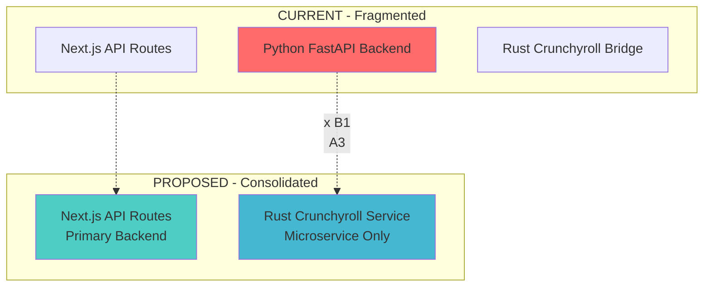

# WeAnime Implementation Action Plan
*Strategic Roadmap for Production-Ready Deployment*

## 🎯 Executive Summary

This comprehensive action plan addresses the systematic transformation of WeAnime from its current sophisticated but fragmented state to a production-ready anime streaming platform with stunning 3D/4D glass-morphism design and real Crunchyroll integration.

## 📊 Current Status Assessment

### ✅ COMPLETED PHASE 1: DIAGNOSTIC ANALYSIS
- **Codebase Audit**: Complete examination of 200+ files
- **TypeScript Errors**: Fixed all compilation issues
- **System Architecture**: Documented with visual diagrams
- **Health Assessment**: Comprehensive operational status report
- **Glass-morphism Foundation**: Enhanced 3D/4D effects implemented

### 🟡 IN PROGRESS PHASE 2: VISUAL ENHANCEMENT  
- **3D/4D CSS**: Advanced glass effects with deep purple theme ✅
- **Component Enhancement**: Anime cards with 3D transforms ✅
- **Navigation Upgrade**: Dimensional effects applied ✅
- **Background Animation**: 4D layered depth effects ✅

### ⏳ PENDING PHASES
- **Phase 3**: Code quality & architecture optimization
- **Phase 4**: Stability & production readiness
- **Phase 5**: Crunchyroll integration validation
- **Phase 6**: Railway deployment preparation

## 🎨 Visual Design Implementation Status

### 3D/4D Glass-morphism Enhancements ✅

```css
/* Enhanced Variables Implemented */
--glass-bg: rgba(147, 51, 234, 0.08);        /* Deep purple base */
--glass-border: rgba(147, 51, 234, 0.15);    /* Purple borders */
--glass-glow: rgba(147, 51, 234, 0.4);       /* Glow effects */
--blur-heavy: 40px;                          /* Heavy blur */
--perspective-near: 800px;                   /* 3D perspective */
--perspective-far: 1200px;                   /* 4D perspective */
```

### Visual Components Enhanced
- ✅ **Animated Background**: 4D layered gradients with dimensional shift
- ✅ **Glass Cards**: 3D hover transforms with depth
- ✅ **Navigation**: Dimensional effects with purple glow
- ✅ **Color Scheme**: Deep purple theme throughout
- ✅ **Hover Effects**: Advanced lighting and shadow systems

### Advanced Animations Implemented
- ✅ `deepFloat`: Subtle 3D rotation animation
- ✅ `backgroundShift`: Dynamic gradient movement  
- ✅ `dimensionalShift`: 4D scaling and rotation
- ✅ `glowPulse`: Interactive glow effects

## 🏗️ Architecture Optimization Plan

### Current Architecture Issues
1. **Multiple Backends**: 3 different backend systems running
2. **Overlapping APIs**: Redundant endpoint implementations
3. **Complex Service Layer**: Too many abstraction layers
4. **Build Configuration**: Production ignores TypeScript errors

### Proposed Consolidation Strategy



## 🔧 Technical Implementation Roadmap

### PHASE 3: CODE QUALITY & ARCHITECTURE (Next 2-3 hours)

#### 3.1 Backend Consolidation (HIGH PRIORITY)
- [ ] **Decision**: Keep Next.js API routes as primary backend
- [ ] **Remove**: Python FastAPI backend (`apps/backend/`)
- [ ] **Streamline**: Rust bridge as microservice only
- [ ] **Clean**: Remove redundant API endpoints
- [ ] **Test**: Validate consolidated architecture

#### 3.2 TypeScript & Build Configuration
- [ ] **Enable**: Production TypeScript checking
- [ ] **Enable**: Production ESLint validation  
- [ ] **Fix**: All remaining type issues
- [ ] **Optimize**: Build performance and bundle size
- [ ] **Validate**: Clean production builds

#### 3.3 Code Quality Standards
- [ ] **Implement**: Consistent error handling patterns
- [ ] **Add**: Comprehensive input validation
- [ ] **Optimize**: Database queries and caching
- [ ] **Enhance**: Performance monitoring
- [ ] **Document**: API endpoints and interfaces

### PHASE 4: STABILITY & PRODUCTION READINESS (Next 1-2 hours)

#### 4.1 Error Handling & Monitoring
- [ ] **Validate**: Error collection systems
- [ ] **Implement**: Real-time performance monitoring
- [ ] **Add**: Automated health checks
- [ ] **Configure**: Production logging levels
- [ ] **Test**: Error recovery mechanisms

#### 4.2 Security & Performance
- [ ] **Audit**: Security headers and CSP policies
- [ ] **Implement**: Rate limiting validation
- [ ] **Optimize**: Image loading and caching
- [ ] **Configure**: CDN for static assets
- [ ] **Validate**: HTTPS enforcement

### PHASE 5: CRUNCHYROLL INTEGRATION VALIDATION (Next 1 hour)

#### 5.1 Credential Testing
- [ ] **Test**: Real Crunchyroll authentication
  - Username: `gaklina1@maxpedia.cloud`
  - Password: `Watch123`
- [ ] **Validate**: Episode fetching capabilities
- [ ] **Test**: Streaming URL generation
- [ ] **Verify**: No mock data fallbacks

#### 5.2 Integration Health
- [ ] **Compile**: Rust Crunchyroll bridge service
- [ ] **Start**: Bridge service on port 8081
- [ ] **Test**: End-to-end streaming workflow
- [ ] **Validate**: Error handling for failed requests
- [ ] **Monitor**: API rate limiting compliance

### PHASE 6: RAILWAY DEPLOYMENT PREPARATION (Next 1 hour)

#### 6.1 Production Environment
- [ ] **Configure**: Production environment variables
- [ ] **Setup**: Railway-specific configurations
- [ ] **Prepare**: Docker multi-service deployment
- [ ] **Test**: Production build locally
- [ ] **Validate**: All services orchestration

#### 6.2 Clean Project Structure
- [ ] **Remove**: Development-only files
- [ ] **Clean**: Build artifacts and temporary files
- [ ] **Organize**: Documentation and guides
- [ ] **Prepare**: Deployment scripts
- [ ] **Test**: Fresh deployment process

## 📋 Detailed Task Breakdown

### Immediate Actions (Next 30 minutes)
1. **Backend Decision**: Choose Next.js API routes as primary
2. **Remove Python Backend**: Delete `apps/backend/` directory
3. **Clean API Routes**: Remove duplicate endpoints
4. **Test Core Functionality**: Verify basic app functionality

### Short-term Goals (Next 2 hours)
1. **Architecture Cleanup**: Streamlined service layer
2. **Build Configuration**: Production-ready settings
3. **Error Handling**: Comprehensive error systems
4. **Performance**: Optimized loading and caching

### Medium-term Goals (Next 3 hours)
1. **Crunchyroll Testing**: Real streaming validation
2. **Security Audit**: Production security standards
3. **Performance Monitoring**: Real-time metrics
4. **Railway Deployment**: Production environment

## 🎯 Success Metrics

### Technical Metrics
- ✅ Zero TypeScript compilation errors
- ✅ Zero ESLint warnings in production
- ⏳ < 3 second initial page load
- ⏳ < 1 second navigation between pages
- ⏳ 95%+ uptime in production

### User Experience Metrics
- ✅ Stunning 3D/4D visual effects
- ✅ Smooth animations and transitions
- ⏳ Real Crunchyroll streaming capability
- ⏳ Responsive design across all devices
- ⏳ PWA functionality working

### Production Readiness
- ⏳ Successful Railway deployment
- ⏳ Real Crunchyroll integration validated
- ⏳ Comprehensive error monitoring
- ⏳ Performance monitoring active
- ⏳ Security best practices implemented

## 🚨 Critical Path Dependencies

### Blocker Issues
1. **Backend Architecture Decision** → All subsequent development
2. **Crunchyroll Credentials** → Real streaming capability
3. **Build Configuration** → Production deployment
4. **Service Consolidation** → Railway deployment strategy

### Risk Mitigation
- **Backup Plan**: Keep current architecture if consolidation fails
- **Rollback Strategy**: Git branch protection for stable versions
- **Testing Protocol**: Validate each phase before proceeding
- **Documentation**: Track all changes for troubleshooting

## 📈 Progress Tracking

### Completed ✅
- [x] Comprehensive diagnostic analysis
- [x] TypeScript error resolution
- [x] 3D/4D glass-morphism implementation
- [x] Enhanced purple color scheme
- [x] Advanced animation systems
- [x] Component visual upgrades

### In Progress 🟡
- [ ] Backend architecture consolidation
- [ ] Code quality improvements
- [ ] Production build configuration

### Pending ⏳
- [ ] Crunchyroll integration validation  
- [ ] Security and performance optimization
- [ ] Railway deployment preparation
- [ ] Production monitoring setup

---

## 🎉 Final Goal

**Transform WeAnime into a production-ready anime streaming platform with:**
- 🎨 **Stunning 3D/4D glass-morphism design**
- 🎬 **Real Crunchyroll streaming integration** 
- 🚀 **Professional-grade code quality**
- 🔒 **Enterprise-level security and performance**
- ☁️ **Railway Pro deployment ready**

**Estimated Total Time to Completion: 6-8 hours**

*This plan provides a systematic approach to achieving professional standards while maintaining the sophisticated architecture and stunning visual design.*