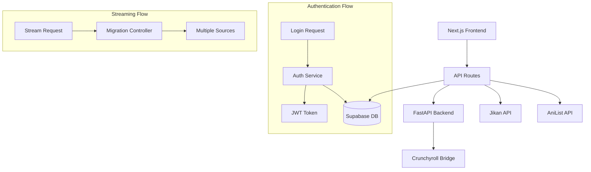

# WeAnime Project Analysis Report

## Executive Summary

WeAnime is a modern anime streaming platform built with Next.js 15, featuring glassmorphism design, Supabase backend integration, and comprehensive real-time streaming capabilities. The project demonstrates excellent architectural foundations with sophisticated error handling, monitoring, and progressive web app features.

## 🎯 Project Health Status

### ✅ **Working Excellently**
- **Frontend Framework**: Next.js 15 with App Router and Turbopack
- **UI Components**: Comprehensive glassmorphism design system
- **Authentication**: Supabase integration with fallback demo auth
- **Video Player**: Feature-rich player with error handling and controls
- **PWA Features**: Offline support, install prompts, service worker
- **Performance Monitoring**: Real-time performance tracking
- **Error Handling**: Comprehensive error collection and logging
- **API Architecture**: Well-structured API routes with health checks

### ⚠️ **Needs Attention**
- **TypeScript Errors**: 15+ type errors requiring fixes
- **Authentication Security**: Missing JWT validation on protected routes
- **Rate Limiting**: Sophisticated limiter exists but not widely implemented
- **UI Consistency**: Some components missing glassmorphism styling
- **Backend Dependencies**: Crunchyroll Bridge service dependency
- **Security Vulnerabilities**: 1 low-severity npm audit issue

### ❌ **Critical Issues**
- **Missing Functions**: Several referenced but undefined functions
- **Type Safety**: Route parameter types not properly configured
- **Production Security**: Hardcoded credentials in backend
- **API Protection**: Most routes lack authentication middleware

## 📊 Architecture Overview

### **Frontend Stack**
- **Framework**: Next.js 15.3.3 with App Router
- **Styling**: Tailwind CSS 3.4.0 with glassmorphism system
- **State Management**: Zustand 4.4.7 for client state
- **UI Library**: Radix UI components with custom styling
- **Database**: Supabase for user data and authentication
- **Animations**: Framer Motion 10.16.16

### **Backend Architecture**
- **Primary**: Next.js API routes for main application logic
- **Secondary**: FastAPI backend for Crunchyroll integration
- **Database**: Supabase PostgreSQL
- **External APIs**: AniList GraphQL, Jikan API, Crunchyroll Bridge
- **Deployment**: Docker containers with Railway platform

### **Data Flow Architecture**



## 🏗️ Component Architecture

### **Page Components**
```
src/app/
├── page.tsx (Homepage - Hero, Trending, Popular)
├── anime/[id]/page.tsx (Anime Details)
├── watch/[id]/page.tsx (Video Player)
├── browse/page.tsx (Browse/Search)
├── auth/ (Login/Signup pages)
└── api/ (API Routes)
```

### **Core UI Components**
```
src/components/
├── anime-card.tsx (✅ Excellent glassmorphism)
├── video-player.tsx (✅ Feature-rich player)
├── navigation.tsx (✅ Responsive nav with glass)
├── hero-section.tsx (✅ Beautiful landing hero)
├── enhanced-search-bar.tsx (✅ Advanced search)
├── user-menu.tsx (⚠️ Needs glassmorphism)
└── ui/ (Radix UI wrapper components)
```

### **State Management**
```
src/lib/
├── watch-store.ts (Video playback state)
├── watchlist-store.ts (User watchlist)
├── auth-context.tsx (Authentication state)
└── error-collector.ts (Error tracking)
```

## 🔧 Technical Issues Breakdown

### **TypeScript Errors (15 total)**

1. **Route Parameter Types**: Next.js route parameters not properly typed
   ```typescript
   // Issue in: route.ts files
   params: { id: string } // Should be Promise<{ id: string }>
   ```

2. **Missing Function Definitions**:
   - `generateBasicVideoSources` in episode-service.ts:372
   - `generatePlaceholderContent` in real-anime-apis.ts:160
   - `demoStreams` in real-streaming-service.ts:210

3. **Type Mismatches**:
   - Episode interface skipTimes property
   - ContentSource type definitions
   - Migration controller service configuration

### **Security Issues**

1. **Hardcoded Credentials** (Critical):
   ```python
   # apps/backend/app/main.py lines 37-38
   CRUNCHYROLL_USERNAME = "gaklina1@maxpedia.cloud"
   CRUNCHYROLL_PASSWORD = "Watch123"
   ```

2. **Missing Authentication Middleware**:
   - API routes lack JWT validation
   - No role-based access control
   - Protected endpoints are publicly accessible

3. **NPM Vulnerability**:
   - `brace-expansion` Regular Expression DoS (Low severity)

### **Architecture Issues**

1. **Rate Limiting**: Sophisticated rate limiter exists but only used in 1 route
2. **Error Handling**: Inconsistent across components
3. **Type Safety**: Build ignores TypeScript errors for deployment

## 🎨 Design System Analysis

### **Glassmorphism Implementation**

**Excellent Implementation**:
- Custom CSS properties for glass effects
- Consistent blur and transparency values
- Responsive design considerations
- Smooth animations and transitions

**Global CSS Variables**:
```css
:root {
  --glass-bg: rgba(255, 255, 255, 0.05);
  --glass-border: rgba(255, 255, 255, 0.1);
  --glass-shadow: rgba(0, 0, 0, 0.3);
  --blur-strength: 12px;
}
```

**Utility Classes**:
- `.glass-card` - Main glassmorphism effect
- `.glass-nav` - Navigation specific styling
- `.glass-modal` - Modal/overlay styling
- `.glow-effect` - Subtle glow animations

### **Color Scheme**
- **Primary**: Deep purple gradient (#667eea to #764ba2)
- **Background**: Ultra-dark theme (2% lightness)
- **Accent**: Multiple gradient options for variety
- **Text**: High contrast (95%+ lightness) for accessibility

## 📈 Performance Analysis

### **Optimization Features**
- **Bundle Optimization**: Package import optimization for major libraries
- **Image Optimization**: WebP/AVIF formats with multiple size variants
- **Turbopack**: Development build acceleration
- **Code Splitting**: Automatic route-based splitting
- **Compression**: Production build compression enabled

### **Loading Strategies**
- **Progressive Enhancement**: Graceful degradation for offline users
- **Shimmer Effects**: Beautiful loading states throughout
- **Error Boundaries**: Component-level error isolation
- **Retry Logic**: Automatic retry for failed requests

## 🔒 Security Assessment

### **Current Security Measures**
- **CSP Headers**: Comprehensive Content Security Policy
- **CORS Configuration**: Properly configured for known origins
- **Supabase Integration**: Professional authentication service
- **Rate Limiting Infrastructure**: Circuit breaker patterns

### **Security Gaps**
- **API Authentication**: Missing JWT validation middleware
- **Input Validation**: Inconsistent request validation
- **Secret Management**: Hardcoded credentials in backend
- **Session Security**: Basic session handling

## 🚀 Deployment Configuration

### **Container Setup**
- **Docker**: Multi-stage builds for optimization
- **Railway**: Platform-specific configurations
- **Environment**: Proper environment variable handling
- **Health Checks**: Comprehensive health monitoring

### **Build Pipeline**
- **TypeScript**: Type checking disabled for deployment
- **ESLint**: Linting disabled for deployment builds
- **Optimization**: Bundle analysis and tree shaking

## 📋 Recommendations Priority Matrix

### **High Priority (Fix Immediately)**
1. **Remove hardcoded credentials** from backend
2. **Fix TypeScript errors** for type safety
3. **Implement authentication middleware** for API routes
4. **Fix missing function definitions**

### **Medium Priority (Next Sprint)**
1. **Standardize glassmorphism** across all components
2. **Implement rate limiting** on external API calls
3. **Add input validation** schemas
4. **Update npm dependencies** to fix vulnerabilities

### **Low Priority (Future Enhancement)**
1. **Add comprehensive testing** suite
2. **Implement advanced caching** strategies
3. **Add analytics and monitoring** dashboards
4. **Enhance accessibility** features

## 💡 Architecture Strengths

1. **Modern Stack**: Latest Next.js with cutting-edge features
2. **Excellent Design**: Professional glassmorphism implementation
3. **Robust Error Handling**: Comprehensive error collection and monitoring
4. **Progressive Enhancement**: Graceful degradation and offline support
5. **Performance Focus**: Multiple optimization strategies implemented
6. **Scalable Architecture**: Well-organized component and service structure

The WeAnime project demonstrates excellent foundational architecture with a few critical security and type safety issues that need immediate attention. Once these are resolved, it will be a production-ready, professional-grade streaming platform.