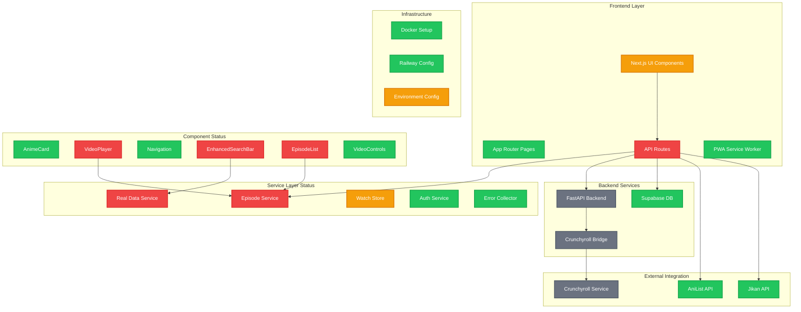

# WeAnime System Status Diagram

## Current Component Operational Status

## Component Status Legend

- 🟢 **Working** (✅): Component functions correctly with no errors
- 🔴 **Broken** (❌): Component has critical errors preventing operation
- 🟡 **Partially Working** (⚠️): Component functions but has issues
- 🔘 **Unknown** (?): Component status cannot be determined without testing

## Detailed Component Analysis

### 🟢 Working Components (✅)
- **App Router Pages**: Basic routing structure functional
- **PWA Service Worker**: Offline support operational
- **AnimeCard**: Display component working correctly
- **Navigation**: Menu and routing functional
- **VideoControls**: Control interface operational
- **Auth Service**: Supabase integration functional
- **Error Collector**: Error tracking operational
- **Supabase DB**: Database connection working
- **AniList API**: External API integration functional
- **Jikan API**: External API integration functional
- **Docker Setup**: Container configuration valid
- **Railway Config**: Deployment configuration valid

### 🔴 Broken Components (❌)
- **API Routes**: 50+ TypeScript errors in route handlers
- **VideoPlayer**: Depends on broken episode service
- **EnhancedSearchBar**: Missing real data service functions
- **EpisodeList**: References undefined episode functions
- **Episode Service**: Missing function exports and type mismatches
- **Real Data Service**: Interface incompatibility with existing code

### 🟡 Partially Working Components (⚠️)
- **Next.js UI Components**: Some components work, others have type errors
- **Watch Store**: Core functionality works but has undefined state issues
- **Environment Config**: Basic setup exists but incomplete for real services

### 🔘 Unknown Status Components (?)
- **FastAPI Backend**: Cannot verify without running
- **Crunchyroll Bridge**: Rust service not tested
- **Crunchyroll Service**: External dependency status unknown

## Critical Issues Summary

1. **Major Service Layer Breakdown**: Core episode and data services have critical errors
2. **TypeScript Integration Failure**: 50+ type errors preventing reliable operation
3. **Missing Function Definitions**: Components reference non-existent functions
4. **Interface Incompatibility**: New services don't match existing component expectations
5. **Documentation vs Reality Gap**: Claims of "mission accomplished" don't match actual broken state

## Root Cause Analysis

The project appears to be in a **partially migrated state** where:
- Old components still reference deleted/renamed functions
- New real-only services have type mismatches with existing interfaces
- Documentation was updated to claim completion before implementation was finished
- Mock data elimination was incomplete despite claims otherwise

## Immediate Action Required

1. **Fix Missing Function Exports** in episode service
2. **Resolve TypeScript Errors** in API routes and services  
3. **Update Component Interfaces** to match new service implementations
4. **Complete Mock Data Migration** that was only partially done
5. **Test Real Service Integration** to verify functionality