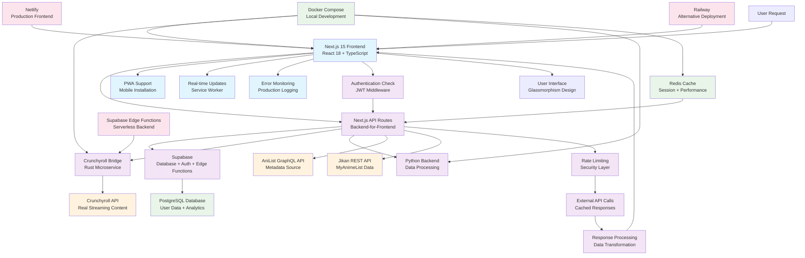
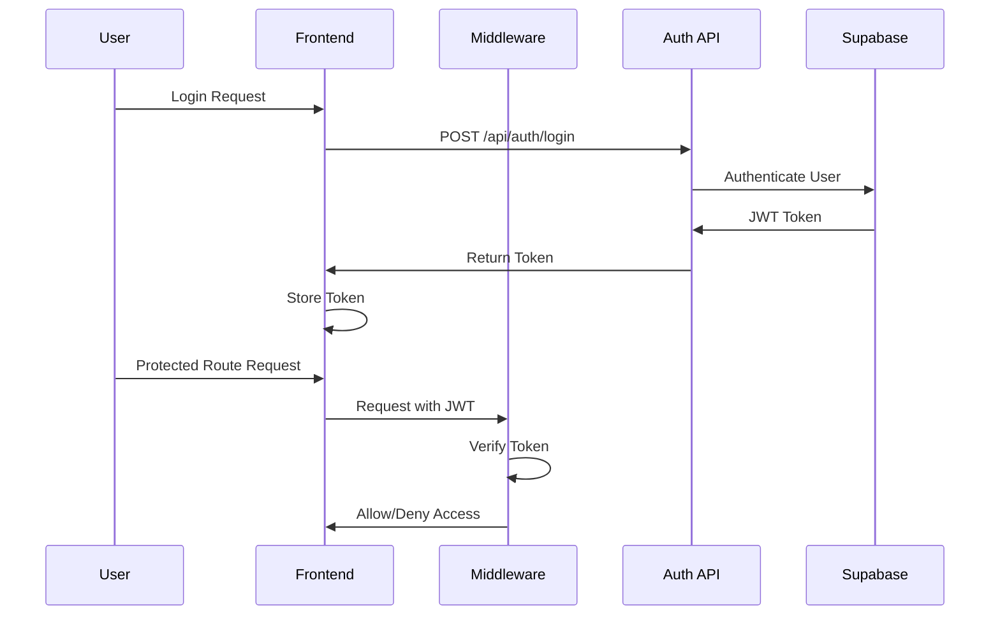
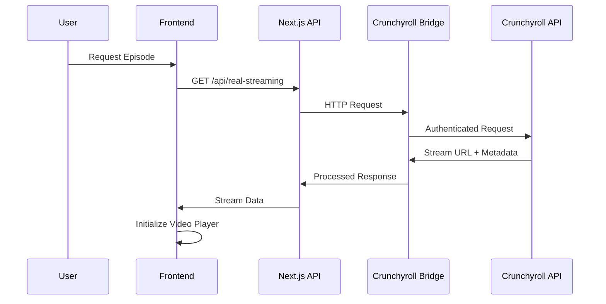

# WeAnime Codebase Analysis Report

*Generated on: June 23, 2025*

## Introduction

WeAnime is a sophisticated, production-ready anime streaming platform built with Next.js 15 and designed around authentic content delivery. The project emphasizes real Crunchyroll integration over mock data, implementing a microservices architecture that separates concerns between frontend presentation, API orchestration, and specialized backend services.

The platform features a modern glassmorphism UI, comprehensive user management through Supabase, and a multi-language backend ecosystem optimized for different aspects of anime streaming and metadata management.

## System Architecture Diagram



## Codebase Structure Analysis

### Directory Architecture

```
WeAnime/
├── src/                          # Source code root
│   ├── app/                      # Next.js App Router (v13+)
│   │   ├── (pages)/             # Route groups for organization
│   │   ├── api/                 # Backend API routes (BFF pattern)
│   │   │   ├── auth/            # Authentication endpoints
│   │   │   ├── anilist/         # AniList API proxy
│   │   │   ├── real-streaming/  # Real Crunchyroll integration
│   │   │   ├── watchlist/       # User watchlist management
│   │   │   └── health-check/    # System monitoring
│   │   ├── admin/               # Administrative dashboards
│   │   ├── layout.tsx           # Root layout with providers
│   │   └── globals.css          # Global styles + CSS variables
│   ├── components/              # Reusable React components
│   │   ├── ui/                  # Base UI components (Shadcn-style)
│   │   ├── admin/               # Admin-specific components
│   │   └── notifications/       # Toast and alert systems
│   ├── lib/                     # Core business logic
│   │   ├── auth-service.ts      # Authentication logic
│   │   ├── supabase.ts          # Database client configuration
│   │   ├── crunchyroll-bridge-client.ts  # Streaming service client
│   │   ├── error-handling.ts    # Production error management
│   │   └── env-validation.ts    # Environment variable validation
│   └── types/                   # TypeScript type definitions
├── scripts/                     # Automation and deployment
│   ├── deploy-production.sh     # Production deployment workflow
│   ├── deploy-staging.sh        # Staging environment setup
│   └── setup-env.js            # Environment configuration
├── supabase/                    # Database and serverless functions
│   ├── migrations/              # Database schema evolution
│   └── functions/               # Edge functions (Deno runtime)
├── next.config.js               # Next.js build configuration
├── docker-compose.yml           # Multi-service development environment
├── netlify.toml                 # Netlify deployment configuration
└── package.json                 # Dependencies and scripts
```

### Key Architectural Patterns

**Backend-for-Frontend (BFF)**: The `src/app/api/` directory implements a BFF pattern, where Next.js API routes act as an orchestration layer between the frontend and multiple backend services.

**Microservices Integration**: The system integrates with specialized services:
- **Rust Crunchyroll Bridge**: High-performance streaming service integration
- **Python Backend**: Data processing and scraping tasks
- **Supabase Edge Functions**: Serverless compute for specific operations

**Component Architecture**: The frontend follows a layered component structure:
- **UI Layer**: Base components in `src/components/ui/`
- **Feature Layer**: Domain-specific components (admin, notifications)
- **Page Layer**: Route-specific components in `src/app/`

## Technology Stack Identification

### Programming Languages

| Language   | Purpose                           | Key Files                                    |
|------------|-----------------------------------|----------------------------------------------|
| TypeScript | Frontend + Next.js API routes    | `src/**/*.ts`, `src/**/*.tsx`               |
| JavaScript | Configuration files               | `next.config.js`, `tailwind.config.js`     |
| Rust       | Crunchyroll Bridge microservice  | Referenced in `docker-compose.yml`          |
| Python     | Backend data processing           | Referenced in `docker-compose.yml`          |
| SQL        | Database schema and migrations    | `supabase/migrations/*.sql`                 |

### Frontend Framework Stack

**Core Framework**: Next.js 15.3.3 with React 18.3.1
- **Routing**: App Router (file-based routing in `src/app/`)
- **Rendering**: Server-side rendering with client-side hydration
- **API**: Built-in API routes for backend functionality

**UI and Styling**:
- **Tailwind CSS 3.4.0**: Utility-first CSS framework
- **Radix UI**: Accessible, unstyled component primitives
  - `@radix-ui/react-dialog`, `@radix-ui/react-dropdown-menu`
  - `@radix-ui/react-select`, `@radix-ui/react-tabs`
- **Framer Motion 10.16.16**: Animation library for smooth transitions
- **Lucide React 0.513.0**: Icon library with consistent design

**State Management**:
- **Zustand 4.4.7**: Lightweight state management for global client state
- **TanStack Query 5.17.0**: Server state management, caching, and synchronization
- **React Context**: Authentication state and theme management

### Backend and Database Stack

**Database**: Supabase (PostgreSQL)
- **ORM**: Supabase client with TypeScript type generation
- **Authentication**: Built-in JWT-based auth with row-level security
- **Real-time**: WebSocket subscriptions for live updates

**Authentication**: 
- **JWT Handling**: `jose 6.0.11` for token verification
- **Middleware**: Custom Next.js middleware for route protection
- **Session Management**: Supabase Auth with automatic token refresh

**Video Streaming**:
- **React Player 2.13.0**: Multi-format video player component
- **HLS Support**: HTTP Live Streaming for adaptive bitrate

### Development and Build Tools

**Build System**:
- **Next.js CLI**: Primary build tool with Turbopack for development
- **TypeScript 5.3.3**: Strict type checking enabled
- **ESLint**: Code quality enforcement during builds

**Development Environment**:
- **Docker Compose**: Multi-container development setup
- **Hot Reload**: Turbopack-powered fast refresh
- **Environment Management**: Structured `.env` file handling

**Runtime Requirements**:
- **Node.js**: Version 20.19.2+ (specified in `package.json`)
- **NPM**: Version 10.0.0+
- **Memory**: Optimized for 1GB heap size in production builds

## Build System and Configuration

### Next.js Configuration Analysis

The `next.config.js` file reveals a production-optimized setup:

**Performance Optimizations**:
```javascript
experimental: {
  optimizePackageImports: ['lucide-react', '@radix-ui/react-dialog']
}
```

**Security Headers**: Comprehensive security configuration including:
- Content Security Policy (CSP) with specific domain allowlists
- X-Frame-Options, X-Content-Type-Options, X-XSS-Protection
- Permissions Policy for camera, microphone, geolocation restrictions

**Image Optimization**: Remote pattern allowlists for:
- AniList CDN (`s4.anilist.co`)
- Crunchyroll images (`img1.ak.crunchyroll.com`)
- MyAnimeList CDN (`cdn.myanimelist.net`)
- YouTube thumbnails (`i.ytimg.com`)

**Webpack Customizations**:
- Path alias configuration (`@` → `src`)
- Server bundle size optimization for production
- Memory optimization with `usedExports` and `sideEffects`

### Package.json Scripts Analysis

**Development Workflow**:
```json
{
  "dev": "next dev --turbopack --port 3000",
  "build": "next build",
  "start": "next start",
  "type-check": "tsc --noEmit",
  "lint": "next lint"
}
```

**Production Optimization**:
```json
{
  "build:optimized": "NODE_OPTIONS='--max-old-space-size=1024' next build",
  "deploy": "npm run build:optimized && netlify deploy --prod"
}
```

**Database Management**:
```json
{
  "db:generate": "supabase gen types typescript --project-id zwvilprhyvzwcrhkyhjy > src/types/database.types.ts"
}
```

### Deployment Configurations

**Netlify Configuration** (`netlify.toml`):
- **Build Command**: `npm ci && npm run build`
- **Publish Directory**: `.next`
- **Plugin**: `@netlify/plugin-nextjs` for serverless deployment
- **Environment Variables**: Production Supabase configuration
- **Functions**: Node.js 20 runtime with 1024MB memory, 30s timeout

**Docker Configuration** (`docker-compose.yml`):
- **Multi-service setup**: Frontend, Crunchyroll Bridge, Python Backend, Redis
- **Network isolation**: Custom bridge network (`weanime-network`)
- **Health checks**: Automated service monitoring
- **Volume persistence**: Redis data persistence

**Production Deployment** (`scripts/deploy-production.sh`):
- **Safety checks**: Git status, branch verification, environment validation
- **Testing pipeline**: TypeScript, ESLint, unit tests, build verification
- **Database migration**: Automated schema deployment checks
- **Multi-platform support**: Vercel, Netlify, Docker deployment options
- **Post-deployment verification**: Health checks, performance monitoring

## Integration Points & Data Flow

### Authentication Flow



**JWT Implementation**:
- **Token Storage**: Client-side storage with automatic refresh
- **Middleware Protection**: Route-level authentication checks
- **Role-based Access**: Admin routes with elevated permissions
- **Session Management**: Supabase handles token lifecycle

### Streaming Data Flow



**Real Streaming Integration**:
- **No Mock Data**: Strict policy against fallback content
- **Rust Bridge**: High-performance Crunchyroll API integration
- **Caching Strategy**: Redis-based response caching
- **Error Handling**: Graceful degradation without mock fallbacks

### External Service Integrations

**Supabase Integration**:
- **Database**: PostgreSQL with enhanced schema (002_enhanced_schema.sql)
- **Authentication**: JWT-based with row-level security
- **Edge Functions**: Serverless compute for specialized operations
- **Real-time**: WebSocket subscriptions for live features

**AniList GraphQL Integration**:
- **Endpoint**: `https://graphql.anilist.co`
- **Purpose**: Anime metadata, trending data, seasonal information
- **Caching**: TanStack Query for client-side caching
- **Rate Limiting**: Built-in request throttling

**Crunchyroll Bridge Architecture**:
- **Language**: Rust for performance and safety
- **Deployment**: Containerized microservice
- **Authentication**: Session-based Crunchyroll login
- **Endpoints**: Search, episodes, streaming sources

## Database Schema Analysis

### Enhanced Schema Features

The `002_enhanced_schema.sql` migration reveals a comprehensive data model:

**User Management**:
- **Enhanced Profiles**: Premium subscriptions, watch analytics, preferences
- **Privacy Controls**: Configurable profile and watchlist visibility
- **Analytics Tracking**: Login patterns, IP tracking, session management

**Content Management**:
- **Anime Metadata**: Multi-source integration (MAL, AniList, Kitsu)
- **Episode Management**: Detailed episode information with video sources
- **Review System**: Multi-dimensional rating system (story, animation, sound, character, enjoyment)

**Community Features**:
- **Forum System**: Categories, threads, posts with moderation
- **Notification System**: Real-time user notifications
- **Recommendation Engine**: Collaborative filtering and genre-based recommendations

**Analytics and Monitoring**:
- **User Sessions**: Detailed session tracking for analytics
- **Page Views**: Comprehensive page view analytics
- **Performance Metrics**: Materialized views for trending content

### Row-Level Security (RLS)

The schema implements comprehensive RLS policies:
- **Public Read Access**: Anime metadata and episodes
- **User-Scoped Data**: Watchlists, reviews, notifications
- **Admin Controls**: Moderation and system management
- **Privacy Enforcement**: Configurable data visibility

## Security Implementation

### Content Security Policy

The Next.js configuration implements a strict CSP:

```javascript
"Content-Security-Policy": 
  "default-src 'self'; " +
  "script-src 'self' 'unsafe-inline' 'unsafe-eval' *.googleapis.com; " +
  "style-src 'self' 'unsafe-inline' fonts.googleapis.com; " +
  "img-src 'self' data: blob: *.anilist.co *.crunchyroll.com; " +
  "media-src 'self' blob: *.googleapis.com *.crunchyroll.com; " +
  "connect-src 'self' *.supabase.co *.anilist.co localhost:8000"
```

**Security Headers**:
- **X-Frame-Options**: SAMEORIGIN (clickjacking protection)
- **X-Content-Type-Options**: nosniff (MIME type sniffing protection)
- **X-XSS-Protection**: 1; mode=block (XSS filtering)
- **Referrer-Policy**: strict-origin-when-cross-origin

### Authentication Security

**JWT Implementation**:
- **Library**: `jose` for secure JWT handling
- **Validation**: Comprehensive token verification in middleware
- **Expiration**: Automatic token refresh through Supabase
- **Storage**: Secure client-side token storage

**Route Protection**:
- **Middleware**: `middleware.ts` protects sensitive routes
- **Role-based Access**: Admin route restrictions
- **Rate Limiting**: API endpoint protection

## Performance Optimizations

### Build Optimizations

**Memory Management**:
- **Heap Size**: Limited to 1024MB for production builds
- **Bundle Splitting**: Optimized chunk splitting for faster loading
- **Tree Shaking**: Unused code elimination

**Image Optimization**:
- **Next.js Image**: Automatic image optimization and lazy loading
- **Remote Patterns**: Allowlisted CDN domains for external images
- **Format Selection**: WebP/AVIF support for modern browsers

### Runtime Performance

**Caching Strategy**:
- **TanStack Query**: Client-side data caching and synchronization
- **Redis**: Server-side caching for API responses
- **CDN Integration**: Static asset delivery optimization

**Code Splitting**:
- **Dynamic Imports**: Lazy loading of non-critical components
- **Route-based Splitting**: Automatic page-level code splitting
- **Component Lazy Loading**: On-demand component loading

## Error Handling and Monitoring

### Production Error Management

**Error Logging System**:
- **Centralized Logging**: `src/lib/error-logger.ts` for error collection
- **Supabase Integration**: Error logs stored in database
- **Real-time Monitoring**: Admin dashboard for error tracking

**Error Boundaries**:
- **React Error Boundaries**: Component-level error isolation
- **Fallback UI**: Graceful degradation for component failures
- **Error Recovery**: Automatic retry mechanisms

### Health Monitoring

**System Health Checks**:
- **API Endpoint**: `/api/health-check` for system status
- **Service Monitoring**: Multi-service health verification
- **Performance Metrics**: Response time and availability tracking

**Production Monitoring**:
- **Deployment Scripts**: Automated health verification post-deployment
- **Performance Tracking**: Response time monitoring
- **Error Rate Monitoring**: Automated alerting for error spikes

## Actionable Insights & Recommendations

### Strengths of Current Architecture

1. **Production-Ready Foundation**: Comprehensive error handling, security headers, and monitoring systems
2. **Scalable Microservices**: Clear separation between frontend, API orchestration, and specialized backend services
3. **Real Data Integration**: Strong commitment to authentic content without mock data fallbacks
4. **Modern Tech Stack**: Latest versions of Next.js, React, and supporting libraries
5. **Comprehensive Security**: JWT authentication, CSP, RLS, and input validation
6. **Performance Optimization**: Memory management, caching strategies, and build optimizations

### Recommendations for Future Development

#### 1. Enhanced Monitoring and Observability

**Implement Distributed Tracing**:
```typescript
// Add to src/lib/tracing.ts
import { trace } from '@opentelemetry/api'

export const tracer = trace.getTracer('weanime-frontend')
```

**Recommendation**: Integrate OpenTelemetry for end-to-end request tracing across the microservices architecture.

#### 2. Advanced Caching Strategy

**Redis Integration Enhancement**:
```typescript
// Add to src/lib/cache-strategy.ts
export class CacheStrategy {
  static readonly ANIME_METADATA_TTL = 3600 // 1 hour
  static readonly STREAMING_URL_TTL = 300   // 5 minutes
  static readonly USER_PREFERENCES_TTL = 1800 // 30 minutes
}
```

**Recommendation**: Implement tiered caching with different TTL strategies for various data types.

#### 3. Real-time Features Enhancement

**WebSocket Integration**:
```typescript
// Add to src/lib/realtime-client.ts
export class RealtimeClient {
  private supabase = createClient()
  
  subscribeToWatchProgress(userId: string, callback: Function) {
    return this.supabase
      .channel(`watch_progress:${userId}`)
      .on('postgres_changes', { event: '*', schema: 'public', table: 'watch_progress' }, callback)
      .subscribe()
  }
}
```

**Recommendation**: Expand real-time capabilities for synchronized watching and live chat features.

#### 4. Advanced Security Enhancements

**Rate Limiting Enhancement**:
```typescript
// Enhance src/lib/rate-limiter.ts
export class AdvancedRateLimiter {
  static readonly STREAMING_REQUESTS_PER_MINUTE = 10
  static readonly SEARCH_REQUESTS_PER_MINUTE = 30
  static readonly AUTH_ATTEMPTS_PER_HOUR = 5
}
```

**Recommendation**: Implement endpoint-specific rate limiting with Redis-backed sliding window counters.

#### 5. Performance Monitoring

**Core Web Vitals Tracking**:
```typescript
// Add to src/lib/performance-monitor.ts
export class PerformanceMonitor {
  static trackCoreWebVitals() {
    // Implement LCP, FID, CLS tracking
  }
  
  static trackStreamingPerformance() {
    // Monitor video loading times and buffering events
  }
}
```

**Recommendation**: Implement comprehensive performance monitoring with automated alerting.

#### 6. Content Delivery Optimization

**CDN Strategy**:
- **Static Assets**: Implement CDN for images, videos, and static content
- **API Caching**: Edge caching for frequently accessed API responses
- **Geographic Distribution**: Multi-region deployment for global performance

#### 7. Database Optimization

**Query Performance**:
```sql
-- Add to future migrations
CREATE INDEX CONCURRENTLY idx_watch_progress_performance 
ON watch_progress (user_id, last_watched DESC, progress_percentage);

CREATE INDEX CONCURRENTLY idx_anime_search_performance 
ON anime_metadata USING GIN(to_tsvector('english', title_english || ' ' || synopsis));
```

**Recommendation**: Implement database query optimization and monitoring for high-traffic scenarios.

### Critical Production Considerations

1. **Zero Mock Data Policy**: Maintain strict enforcement of real data sources
2. **Error Recovery**: Implement circuit breakers for external service failures
3. **Scalability Planning**: Prepare for horizontal scaling of microservices
4. **Security Auditing**: Regular security assessments and dependency updates
5. **Performance Budgets**: Establish and monitor performance thresholds
6. **Disaster Recovery**: Implement backup and recovery procedures for critical data

### Development Workflow Enhancements

1. **Automated Testing**: Expand test coverage for critical user flows
2. **CI/CD Pipeline**: Enhance deployment automation with rollback capabilities
3. **Environment Parity**: Ensure development environment matches production
4. **Documentation**: Maintain up-to-date API documentation and deployment guides
5. **Code Quality**: Implement automated code quality checks and security scanning

This architecture provides a solid foundation for a production-ready anime streaming platform with authentic content delivery and robust user management capabilities.
